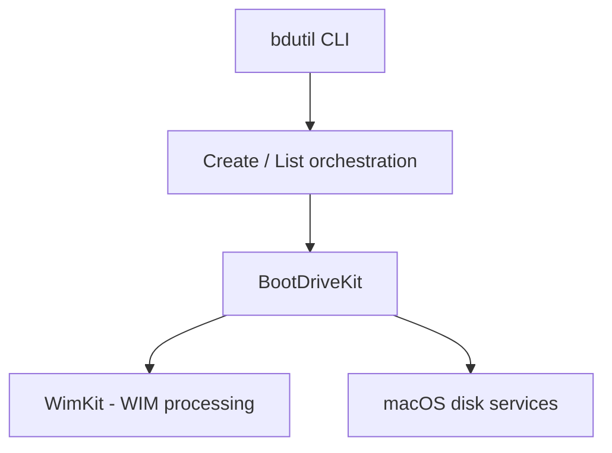

# `bdutil` Technical Overview

An architectural description of `bdutil` (Boot Drive Utility), a command-line tool written in Swift and optimized for Apple silicon, for creating bootable media devices on macOS 15 or newer.

## Purpose

`bdutil` creates bootable USB media from Windows ISO images, Linux/UNIX ISO images, and macOS installer apps or DMG files. It is designed as a native macOS replacement for fragmented workflows that combine `diskutil`, `dd`, and `wimlib imagex`, offering a single, safe, validated command interface.

## Architecture

`bdutil` is organized in three layers:

1. **CLI layer** — built on Apple's [swift-argument-parser](https://github.com/apple/swift-argument-parser). The entry point (`Application`) exposes two subcommands:
   - `bdutil list` — enumerates removable/external disk devices.
   - `bdutil create <dos|unix|macos>` — creates bootable media, with per-platform subcommands.
2. **Orchestration layer** — the `Create` and `List` components validate inputs (readable image files, valid disk devices) and drive the creation pipeline: privilege check → image mount → device format → file copy → image unmount → volume eject.
3. **Engine layer** — [BootDriveKit](https://github.com/ancestral-labs/BootDriveKit), a Swift package that performs low-level bootable media creation, processing, and process management. BootDriveKit depends on **WimKit**, an LGPL-licensed library for Windows Imaging (WIM) format processing.

## Command reference

| Command | Description |
| --- | --- |
| `bdutil list` | List removable devices available as targets. |
| `bdutil create dos <image> <dev> [--scheme gpt\|mbr] [--file-system fat32\|exfat] [--quiet]` | Create a bootable Windows (DOS/UEFI) device from an ISO. |
| `bdutil create unix <image> <dev> [--quiet]` | Create a bootable Linux/UNIX device from an ISO. |
| `bdutil create macos <app-or-dmg> <dev> [--quiet]` | Create a bootable macOS installer device. |
| `bdutil --help` / `bdutil --version` | Help and version information. |

## WIM processing and `wimlib imagex` comparison

Windows ISO images ship their installation payload as a WIM (Windows Imaging) file. On FAT32 targets, files larger than 4 GB traditionally require splitting or converting the image with `wimlib imagex split` or `wimlib-imagex apply` — a manual, error-prone extra step on macOS.

`bdutil` integrates WIM processing directly through WimKit inside BootDriveKit:

- No external `wimlib` installation is required.
- WIM handling happens in-process during the copy stage.
- Partition scheme (GPT/MBR) and file system (FAT32/ExFAT) are chosen with validated flags instead of manual `diskutil partitionDisk` invocations.

For macOS users searching for "`wimlib imagex` on macOS", "create Windows bootable USB on Mac", or "Rufus alternative for macOS", `bdutil` provides the complete workflow in one command.

## Validation and safety

- Image paths are validated for existence and readability before any disk operation.
- Device arguments are validated as real, accessible disk devices.
- The creation pipeline reports each stage and ejects the volume automatically on completion.

## Platform requirements

- Apple silicon Mac.
- macOS 15 or newer — `bdutil` relies on features and enhancements introduced in macOS 15.

## Licensing

- `bdutil` is distributed under the EULA terms in [LICENSE](../LICENSE).
- WimKit is open source under the LGPL license and is currently the only component whose repository can be distributed under those terms.

## Project status

The project is under active development. Stability is only guaranteed within minor versions (e.g. between 0.1.1 and 0.1.2); minor releases may include breaking changes until 1.0.0.

## Next steps

- Follow the guided [Tutorial](./Tutorial.md).
- Learn concrete tasks in the [How-To guide](./HowTo.md).
- View the [API documentation](https://ancestral-labs.github.io/bdutil/Documentation/).
- Return to the [README](../README.md).

## Copyright

© 2023-2026 Ancestral Labs

Licensed under the Apache License, Version 2.0.
